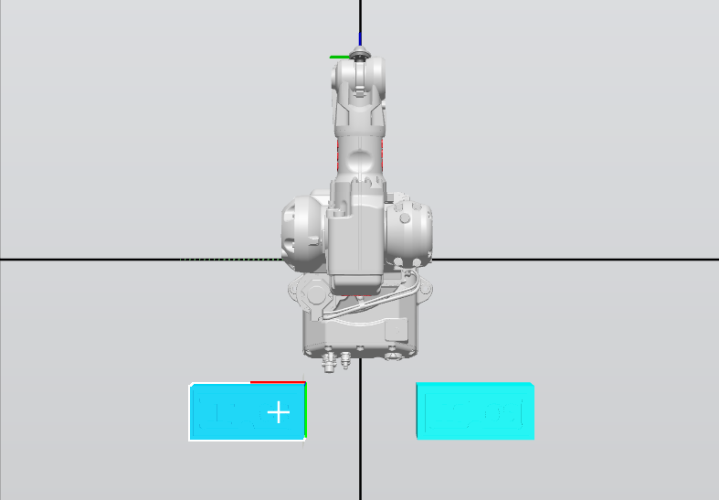
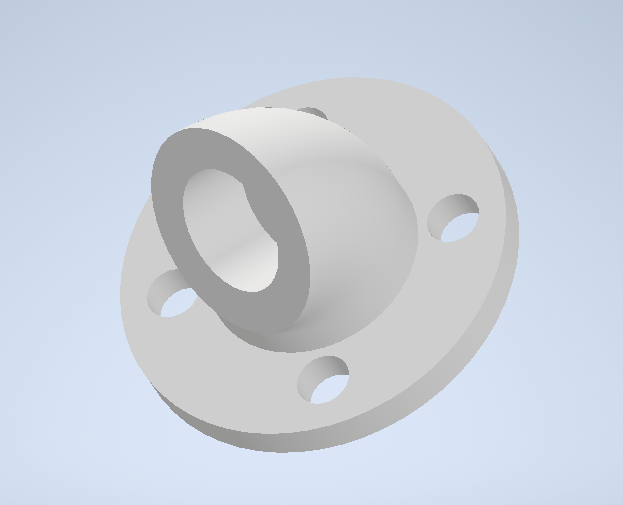

# Robotica2025-1_Laboratorio2
Repositorio destinado para subir archivos de simulación, diseño, de la practica 2 de laboratorio.

En esta practica de laboratorio realizaremos una simulacion e implementacion en un manipulador de la marca ABB (IRB140). Nos basaremos en la industria de la decoración de pasteles ya que buscaremos crear una imagen que muestre las iniciales de los integrantes del grupo. Para esto haremos uso del software RobotStudio donde crearemos una simulacion de la maquina, de la herramienta creada y del proceso de dibujo (trayectorias).

### Diagrama de flujo

La siguiente imagen es respecto al diagrama de flujo del proceso realizado por el robot:


### Planos del sistema

A continuación veremos la distribucion del manipulador y del objeto de trabajo, asi como una vista general:



>Vista superior


>Distribución general

### Funciones utilizadas

En la parte de la programación del controlador tenemos las siguientes funciones:

- PROC y ENDPROC: Estas palabras estan reservadas para la creacion de "funciones", que en este caso se denominan procedimientos

    ```
    PROC nombre()
    ...instrucciones...
    ENDPROC
    ```

- main: Es el nombre de la rutina principal, aqui se ejecuta el ciclo continuamente
- Reset y Set: Son las palabras usadas para manipular salidas digitales, tambien se puede usar con salidas virtuales o una señal a un "Smart Component"

    ```
    Set DO_01;
    Reset DO_01;
    Set vDO_01;
    ```

- WaitTime: Pausa la ejecución durante un numero de segundos

    ```
    WaitTime 2;
    ```

- WHILE TRUE DO ... ENDWHILE: Es la forma en que se genera un ciclo
- IF ... THEN ... ELSEIF ... ENDIF: Es un condicional usado para las entradas digitales

    ```
    IF DI_01 = 1 THEN
        ...
    ```

- MoveJ, MoveL y MoveC: Estos comandos son usados para poder mover el robot.
    - MoveJ realiza un movimiento conjunto entre posiciones sin seguir una linea recta. (Se usa para desplazamientos no críticos).
    - MoveL realiza movimiento lineal entre puntos.
    - MoveC hace movimiento circular entre dos puntos intermedios, creando un arco o una curva.
- TCP_Marcador y Workobject_pastel: Estas funciones permiten determinar los sistemas de coordenadas para la herramienta y el objeto de trabajo.
- Por ultimo tenemos distintas funciones que son personalizadas:
    - dibujar: Secuencia completa de trazado
    - Path_Home: Lleva al robot a una posicion de inicio
    - Path_Bor_Ext, Path_Bor_Int: Traza el borde de la figura
    - Path_Decorado: Crea una linea "decorativa"
    - Path_S, Path_01, Path_02, Path_J, Path_T, Path_J: Trazan las letras o figuras específicas
    - Path_Mantenimiento: Lleva el robot a una posicion donde se puede manipular la herramienta facilmente

### Herramienta (TCP)

Para la creacion de la herramienta se busco que fuera modular para mayor facilidad a la hora de montarla en el manipulador y tambien al insertar el marcador. La herramienta tiene un tamaño particular ya que buscamos que tenga una tolerancia para el marcador, ya que en caso de que se mueva un poco mas de lo debido, no daña directamente el marcador ni la herramienta.

A continuacion vemos el diseño en CAD:


>Diseño CAD

Cada una de las partes son:

- Base:

- Cuerpo:

- Tapa:


### Código en RAPID

En el siguiente link se encuentra el código fuente utilizado en el modulo 1 del controlador:

[Codigo fuente Rapid](RobotStudio/Project_Lab2.rspag/Controller%20Data/Controller_Lab2/RAPID/TASK1/PROGMOD/Module1.mod)